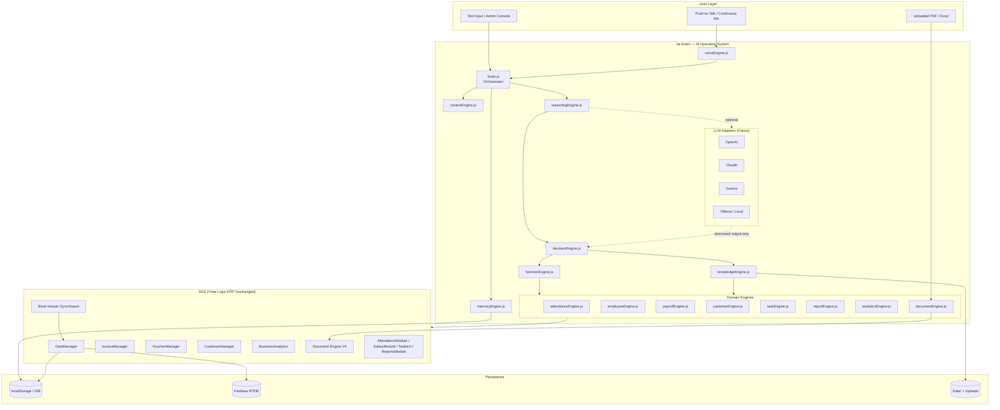
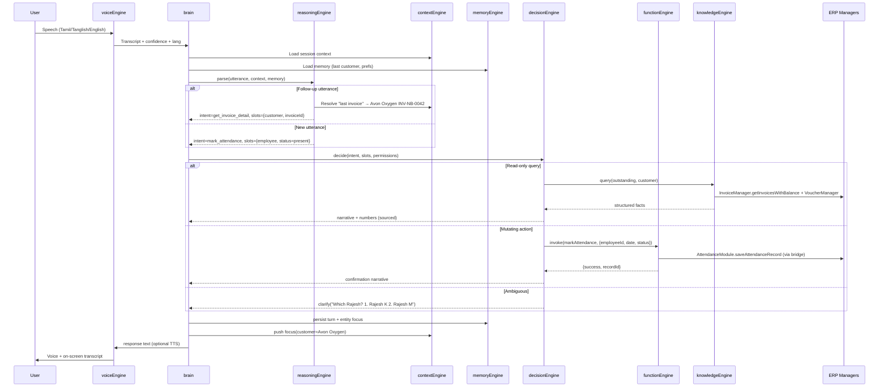
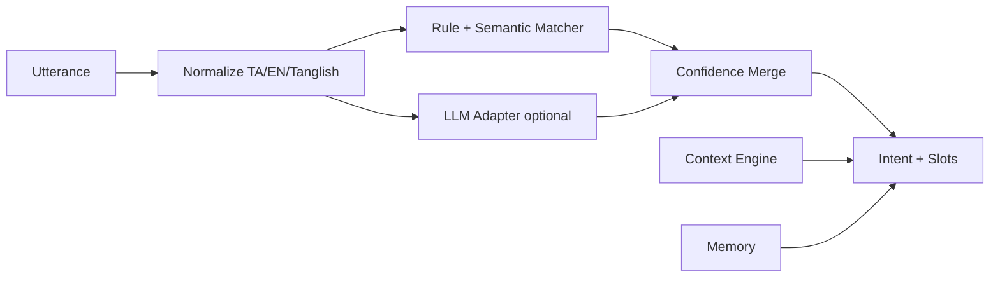
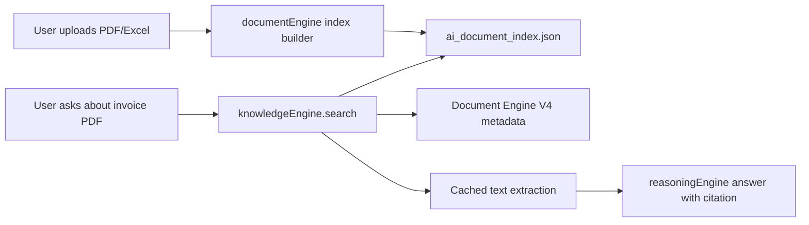
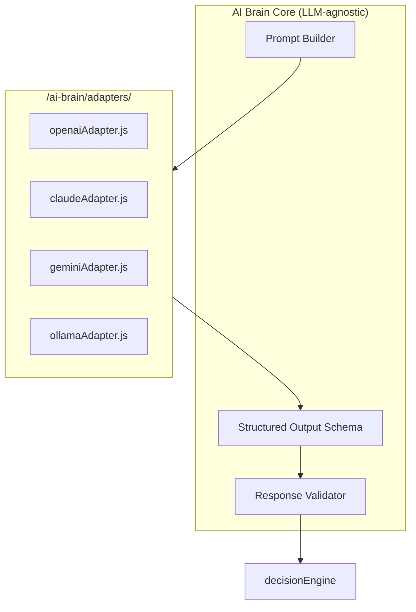

# MJS Prime Logic — AI Brain V1
## Phase 1 Architecture (Approval Required)

**Status:** DRAFT — awaiting approval before any `/ai-brain/` implementation  
**Date:** 2026-06-05  
**Scope:** ERP AI Operating System — not a chatbot, not a GPT wrapper

---

## 1. Executive Summary

AI Brain V1 elevates MJS Prime Logic from a **rule-based voice assistant** (`/ai/`, V1) into a **full ERP operating brain** (`/ai-brain/`). The brain:

- Understands **Tamil, English, Tanglish** (voice + text) via **intent**, not hardcoded phrases
- Maintains **conversation memory** and **self-learning preferences**
- Calls **real ERP functions** — never guesses financial or HR outcomes
- Reads **live ERP data**, **Book Keeper imports**, and **documents** (PDF/Excel via Document Engine V4)
- Supports **autonomous analysis** and **admin assistant mode**
- Stays **LLM-agnostic** via adapter layer (OpenAI, Claude, Gemini, Ollama) without changing ERP code

**Phase 1 deliverable:** this document only. **No code** in `/ai-brain/` until approved.

**Relationship to existing `/ai/`:** V1 voice stack remains operational during migration. AI Brain absorbs and replaces it module-by-module behind a compatibility façade.

---

## 2. System Architecture Diagram



### 2.1 Module Responsibilities

| Module | Role |
|--------|------|
| **brain.js** | Single entry point. Session lifecycle, turn loop, safety gates, response assembly |
| **reasoningEngine.js** | Intent resolution, slot filling, multi-turn inference, Tamil/Tanglish normalization |
| **memoryEngine.js** | Short-term dialog memory + long-term usage patterns (customers, employees, reports) |
| **contextEngine.js** | Active entity stack (last customer, last invoice, pending confirmation, view context) |
| **voiceEngine.js** | STT/TTS, PTT, continuous listen, language detect; wraps existing speech adapters |
| **knowledgeEngine.js** | Read-only knowledge graph over ERP entities, BK data, uploaded files |
| **functionEngine.js** | Typed ERP function registry, validation, execution, audit trail |
| **decisionEngine.js** | Chooses: answer from knowledge / call function / ask clarify / refuse |
| **documentEngine.js** | Query PDFs, Excel, invoices, challans via Document Engine + file index |
| **\*Engine.js** (domain) | Domain-specific planners that map intents → function calls + narratives |

---

## 3. Data Flow Diagram



### 3.1 Turn Pipeline (Deterministic Core)

Every turn follows **seven stages** — LLM may assist stages 2–4 only; stages 5–7 are always deterministic:

1. **Ingest** — transcript/text + UI context (current view, FY filter)
2. **Normalize** — Tamil/Tanglish token map, entity extraction, temporal resolution
3. **Understand** — intent + slots + confidence (hybrid: rules + optional LLM)
4. **Context bind** — resolve pronouns/follow-ups via `contextEngine`
5. **Authorize** — `UserManager` permissions + destructive confirm gate
6. **Execute** — `functionEngine` calls real ERP APIs; no direct JSON mutation
7. **Respond** — templated narrative + structured card; log to audit

---

## 4. Database Access Plan

AI Brain is **read-mostly** with **controlled writes** through function registry only.

### 4.1 Access Tiers

| Tier | Access | Examples | Gate |
|------|--------|----------|------|
| **T0 Public read** | Aggregate, non-PII | Dashboard KPIs, stock counts | Any logged-in user |
| **T1 Domain read** | Entity lists + balances | Outstanding, attendance today | Role permission |
| **T2 Entity read** | Single customer/employee/invoice | Last invoice, payslip | Role + party scope |
| **T3 Write** | Create/update/delete | Mark attendance, create task | Role + confirm if destructive |
| **T4 Admin** | Import, payout, BK sync | Salary payout list, BK import | Admin only |

### 4.2 Data Sources (via `knowledgeEngine`)

| Source | Access API | Cache TTL | Notes |
|--------|------------|-----------|-------|
| Employees | `DataManager.getEmployees()` | 5 min | Active filter default |
| Attendance | `DataManager.getAttendance()` | 1 min | Date-scoped queries |
| Customers | `CustomerManager.getAllCustomers()` | 10 min | Fuzzy name index built in-memory |
| Invoices | `InvoiceManager.getInvoicesWithBalance()` | 2 min | Invalidate on voucher save |
| Vouchers | `VoucherManager.getAllVouchers()` | 2 min | Allocation map cached |
| Purchases | `DataManager.getData('purchases')` | 5 min | Supplier dues |
| Tasks | `DataManager.getData('gtes_tasks')` | 1 min | Pending filter |
| Payroll | `SalaryModule` / `ReportsModule` helpers | On demand | Month-scoped |
| Challans | `DeliveryManager.getAllChallans()` | 5 min | |
| Quotations / PO | `DataManager` estimate/PO keys | 5 min | |
| BK data | Rows with `bookkeeperId` / `source:bookkeeper` | Same as parent | Never override LOCAL rows |
| GST / Ledger | `BusinessAnalytics.*` | 5 min | FY from dashboard context |
| Documents | `DocumentEngine` + file manifest | Per session | PDF text extraction index |
| Uploads | `Data/uploads/` manifest (new) | Per file | Indexed at upload time |

### 4.3 Write Path (Strict)

```
decisionEngine → functionEngine.invoke(name, args)
  → validate schema + permissions
  → call ErpBridge (thin wrapper over existing managers)
  → DataManager.saveData (existing merge/dedupe rules)
  → AuditManager.log
  → invalidate relevant caches (InvoiceManager, VoucherManager, AI knowledge cache)
```

**AI Brain never calls `saveData` directly.**

### 4.4 Cloud Sync Boundary

- Reads: local `DataManager` cache (already RTDB-hydrated)
- Writes: same path as UI → `FileStorage` debounced cloud write
- AI must respect `SyncManager` conflict state — refuse writes during active BK import

---

## 5. Function Registry

All functions are registered in `functionEngine.js`. Each entry:

```typescript
{
  name: string,
  domain: 'attendance' | 'payroll' | 'customer' | ...,
  tier: 'T1' | 'T2' | 'T3' | 'T4',
  destructive: boolean,
  confirmMessage?: string,
  parameters: JSONSchema,
  handler: (args, ctx) => Promise<FunctionResult>,
  erpBinding: string  // actual manager method
}
```

### 5.1 Attendance Functions

| Function | ERP Binding | Tier |
|----------|-------------|------|
| `attendance.mark` | `AttendanceModule.saveAttendanceRecord` | T3 |
| `attendance.markBulk` | `AttendanceModule.saveBulkAttendance` | T3 |
| `attendance.getAbsentToday` | `ErpFunctions.getAbsentEmployeesForDate` | T1 |
| `attendance.getMonthlySummary` | `DataManager.getAttendanceByMonth` | T1 |
| `attendance.delete` | `AttendanceModule.deleteAttendanceRecord` | T3 ⚠ |

### 5.2 Employee Functions

| Function | ERP Binding | Tier |
|----------|-------------|------|
| `employee.list` | `DataManager.getActiveEmployees` | T1 |
| `employee.search` | Fuzzy match over employees | T1 |
| `employee.getDetails` | Employee record + attendance slice | T2 |
| `employee.getOtHours` | `DataManager.calcOT` | T2 |

### 5.3 Payroll Functions

| Function | ERP Binding | Tier |
|----------|-------------|------|
| `payroll.getSummary` | `SalaryModule` month summary | T2 |
| `payroll.generatePayoutList` | `ReportsModule.getSalaryPayoutData` | T4 |
| `payroll.generatePayslips` | `ReportsModule.generatePayslips` | T4 |

### 5.4 Customer / CRM Functions

| Function | ERP Binding | Tier |
|----------|-------------|------|
| `customer.search` | `CustomerManager.searchCustomers` | T1 |
| `customer.getOutstanding` | `BusinessAnalytics.getOutstandingBalances` / invoice balance | T1 |
| `customer.getLastInvoice` | Filtered `InvoiceManager` | T2 |
| `customer.getInvoiceList` | Party-scoped invoices | T2 |
| `customer.getLedger` | `BusinessAnalytics.getCustomerLedger` | T2 |

### 5.5 Financial / Invoice Functions

| Function | ERP Binding | Tier |
|----------|-------------|------|
| `invoice.list` | `InvoiceManager.getInvoicesWithBalance` | T1 |
| `invoice.get` | `InvoiceManager.getInvoice` | T2 |
| `invoice.create` | Navigate + prefill (Phase 2); direct create Phase 3 | T3 |
| `invoice.getOverdue` | Filter by date + balance | T1 |
| `voucher.list` | `VoucherManager.getAllVouchers` | T1 |
| `voucher.getAllocations` | `VoucherManager.getVoucherAllocationsMap` | T2 |

### 5.6 Task Functions

| Function | ERP Binding | Tier |
|----------|-------------|------|
| `task.listPending` | `TasksUI` data filter | T1 |
| `task.create` | `TasksUI.saveTask` | T3 |
| `task.complete` | `ErpFunctions.completeTaskByHint` | T3 |
| `task.postpone` | `TasksUI.postponeTask` | T3 |

### 5.7 Document Functions

| Function | ERP Binding | Tier |
|----------|-------------|------|
| `document.preview` | `DocumentEngine.openPreview` | T2 |
| `document.search` | Upload index + invoice/challan metadata | T2 |
| `document.extractAnswer` | PDF text index Q&A | T2 |

### 5.8 Report / Analytics Functions

| Function | ERP Binding | Tier |
|----------|-------------|------|
| `report.gstr1` | `BusinessAnalytics.generateGSTR1` | T2 |
| `report.gstr3b` | `BusinessAnalytics.generateGSTR3B` | T2 |
| `report.cashFlow` | `BusinessAnalytics.getCashFlowData` | T2 |
| `report.dashboard` | `DashboardQueries.buildLiveDataset` | T1 |
| `report.attendanceSummary` | Admin assistant composite | T1 |
| `report.overdueInvoices` | Admin assistant composite | T1 |
| `report.customerFollowUp` | Outstanding + last contact | T4 |

### 5.9 Navigation / System

| Function | ERP Binding | Tier |
|----------|-------------|------|
| `nav.go` | `App.showView` | T1 |
| `system.help` | Capability manifest | T0 |
| `system.getVersion` | `UpdateChecker` | T0 |

---

## 6. Memory Registry

### 6.1 Short-Term Memory (Session — `contextEngine` + `memoryEngine`)

| Key | TTL | Example |
|-----|-----|---------|
| `focus.customer` | Session | Avon Oxygen |
| `focus.employee` | Session | Rajesh |
| `focus.invoice` | Session | INV-NB-0042 |
| `focus.date` | Session | yesterday → resolved ISO date |
| `lastIntent` | Session | get_outstanding |
| `pendingClarify` | Until resolved | {type: 'pick_employee', options: [...]} |
| `pendingConfirm` | Until resolved | delete attendance |
| `turnHistory` | Last 20 turns | [{role, text, intent, ts}] |

### 6.2 Long-Term Memory (Self-Learning — `memoryEngine`)

Stored in `localStorage` key `gtes_ai_brain_memory_v1`:

| Key | Purpose | Update Rule |
|-----|---------|-------------|
| `freq.customers[]` | Top 20 customers by query count | Increment on each customer query |
| `freq.employees[]` | Top 20 employees | Increment on attendance/payroll queries |
| `freq.reports[]` | Top 10 report types | Increment on report generation |
| `freq.actions[]` | Top 15 intents | Increment on successful execution |
| `aliases.customers{}` | Spoken alias → customerId | User correction + auto-learn |
| `aliases.employees{}` | Spoken alias → employeeId | User correction |
| `langPreference` | ta / en / tanglish | Detected dominant language |
| `voiceSettings` | STT provider, TTS on/off | User settings |

### 6.3 Memory Resolution Example

```
Turn 1: "Avon Oxygen pending evlo?"
  → focus.customer = Avon Oxygen
  → freq.customers[Avon Oxygen]++

Turn 2: "Last invoice kaatu"
  → no customer in utterance
  → contextEngine resolves focus.customer
  → intent = customer.getLastInvoice(slots={customer: Avon Oxygen})
```

---

## 7. Intent Registry

Intents are **semantic goals**, not command strings. Multiple surface forms map to one intent via `reasoningEngine`.

### 7.1 Intent Taxonomy

| Domain | Intent ID | Slots | Mutating |
|--------|-----------|-------|----------|
| Attendance | `attendance.mark` | employee, date, status, ot | Yes |
| Attendance | `attendance.query_absent` | date | No |
| Attendance | `attendance.query_summary` | month, employee? | No |
| Customer | `customer.outstanding` | customer | No |
| Customer | `customer.last_invoice` | customer | No |
| Customer | `customer.invoice_list` | customer, fy? | No |
| Employee | `employee.list` | filter? | No |
| Employee | `employee.details` | employee | No |
| Payroll | `payroll.summary` | month, employee? | No |
| Payroll | `payroll.payout_list` | month | Yes (gen) |
| Task | `task.create` | title, assignee?, due? | Yes |
| Task | `task.list_pending` | assignee? | No |
| Task | `task.complete` | taskHint | Yes |
| Invoice | `invoice.overdue_list` | fy?, customer? | No |
| Report | `report.generate` | reportType, fy?, month? | No |
| Analytics | `analytics.cash_flow` | period | No |
| Analytics | `analytics.revenue_trend` | period | No |
| Document | `document.find` | docType, ref? | No |
| Admin | `admin.daily_summary` | date | No |
| System | `system.help` | — | No |
| System | `system.navigate` | view | No |

### 7.2 Tamil / Tanglish → Intent Mapping (Semantic Layer)

`reasoningEngine` applies a **semantic normalizer** before intent classification:

| Surface forms (examples) | Normalized action | Intent |
|--------------------------|-------------------|--------|
| Rajesh attendance podu / inniku vandhuttan / present / mark pannu | MARK_PRESENT(rajesh) | `attendance.mark` |
| pending evlo / outstanding / balance / kadan | QUERY_OUTSTANDING | `customer.outstanding` |
| last invoice kaatu / recent bill | QUERY_LAST_INVOICE(focus.customer) | `customer.last_invoice` |
| yaar yaar absent / who absent today | QUERY_ABSENT(today) | `attendance.query_absent` |
| salary pending / payout list | PAYROLL_QUERY | `payroll.summary` / `payroll.payout_list` |

**Design rule:** Pattern tables in `/ai/tamilCommandRegistry.js` become **training seeds** for the semantic layer, not the sole classifier.

### 7.3 Intent Confidence & Fallback

| Confidence | Action |
|------------|--------|
| ≥ 0.85 | Execute or answer |
| 0.60–0.84 | Confirm: "Mark Rajesh present for today?" |
| 0.40–0.59 | Clarify slot or entity |
| < 0.40 | Refuse + suggest help |

---

## 8. Voice Registry

### 8.1 Speech-to-Text Providers

| Provider | Adapter | Mode | Default |
|----------|---------|------|---------|
| Browser Web Speech | `browserSpeechAdapter` | Free, offline-capable | **Yes (Phase 2)** |
| OpenAI Whisper | `openaiSpeechAdapter` | Cloud | Optional |
| Google STT | `googleSpeechAdapter` | Cloud | Optional |
| Deepgram | `deepgramSpeechAdapter` | Cloud | Optional |

### 8.2 Text-to-Speech

| Provider | Languages | Notes |
|----------|-----------|-------|
| Browser Speech Synthesis | en, ta (device-dependent) | Default |
| OpenAI TTS | en | Optional |
| Google TTS | en, ta | Optional |

### 8.3 Listen Modes

| Mode | Trigger | Use case |
|------|---------|----------|
| **Push-to-Talk** | Hold mic button | Noisy shop floor (default) |
| **Continuous** | Toggle listen | Hands-free admin desk |
| **Text-only** | Keyboard | Silent environments |

### 8.4 Language Detection

1. Unicode Tamil block ratio → `ta`
2. Tanglish markers (romanized Tamil function words: evlo, podu, kaatu, inniku) → `tanglish`
3. Default → `en`

`voiceEngine` passes `langHint` to `reasoningEngine` for tokenizer selection.

---

## 9. Reasoning Engine Design

### 9.1 Hybrid Architecture (Not Pure LLM)



**Phase 2:** Rules-only (migrate `/ai/intentEngine.js` logic)  
**Phase 3:** Rules primary, LLM disambiguation  
**Phase 4:** LLM primary for language, rules validate ERP actions

### 9.2 Autonomous Analysis Queries

| Question | Engine chain |
|----------|--------------|
| Who is absent today? | `attendanceEngine` → `attendance.getAbsentToday` |
| Which customers have pending payments? | `analyticsEngine` → outstanding aggregation |
| Which employees have salary pending? | `payrollEngine` → month payout status |
| Which invoices are overdue? | `customerEngine` + date filter |
| What tasks are pending? | `taskEngine` → `task.listPending` |
| Which projects are delayed? | `taskEngine` → overdue task filter |

### 9.3 Admin Assistant Mode

Composite reports built by `decisionEngine` orchestrating multiple function calls:

| Command | Functions invoked |
|---------|-------------------|
| Generate salary payout list | `payroll.generatePayoutList` |
| Generate customer follow-up list | `customer.getOutstanding` + sort + contact metadata |
| Generate pending task list | `task.listPending` |
| Today's attendance summary | `attendance.getAbsentToday` + present count |
| Overdue invoice report | `invoice.getOverdue` |

---

## 10. Document Access Architecture



| Document type | Source | Index strategy |
|---------------|--------|----------------|
| Sales invoices | `InvoiceManager` + PDF on disk | invoiceNo, customer, date, total |
| Quotations / PO | DataManager keys | ref, party, amount |
| Challans | `DeliveryManager` | challanNo, customer |
| BK imports | bookkeeperId linkage | Cross-ref to ERP rows |
| Ad-hoc uploads | Upload folder | Full-text extract (pdf.js / sheet parse) |

**Rule:** Answers citing documents must include **source ref** (invoiceNo, file name, page).

---

## 11. LLM Adapter Layer (Future-Ready)



| Concern | LLM role | ERP role |
|---------|----------|----------|
| Language understanding | Suggest intent + slots | Validate against registry |
| Summarization | Narrate report results | Compute numbers |
| Disambiguation | Rank candidates | Authoritative entity lookup |
| Action execution | **Never** | `functionEngine` only |

**Contract:** LLM output must be JSON matching `IntentCandidate[]` schema — never raw SQL, never direct data writes.

---

## 12. Migration from `/ai/` (V1 Voice)

| V1 Module | V2 Brain Module | Strategy |
|-----------|-----------------|----------|
| `voiceAgent.js` | `brain.js` + `voiceEngine.js` | UI rewire |
| `intentEngine.js` | `reasoningEngine.js` | Absorb + extend |
| `intentRegistry.js` | Intent Registry (§7) | Superset |
| `tamilCommandRegistry.js` | Semantic seed data | Import patterns |
| `commandRouter.js` | `decisionEngine.js` | Replace |
| `erpFunctions.js` | `functionEngine.js` | Formalize registry |
| `contextManager.js` | `contextEngine.js` | Merge |
| `memoryManager.js` | `memoryEngine.js` | Extend |
| `*Agent.js` | `*Engine.js` | Rename + enrich |

V1 remains until V2 reaches feature parity on attendance, customer, employee, task domains.

---

## 13. Risk Analysis

| Risk | Severity | Mitigation |
|------|----------|------------|
| LLM hallucinates financial figures | **Critical** | All numbers from `functionEngine`; LLM narrates only |
| Wrong customer/employee match | **High** | Fuzzy match + confirm + disambiguation pick list |
| Destructive action via voice | **High** | `destructive: true` → spoken + UI confirm |
| Tamil/Tanglish misparse | **High** | Semantic normalizer + clarify fallback |
| Norm-key collision (invoice refs) | **High** | Party-scoped allocation keys (fixed v1.3.44); apply same rule in brain |
| BK vs LOCAL data conflict | **High** | Read precedence: LOCAL > voucher allocation > BK status |
| Cloud sync race during write | **Medium** | Refuse T3 writes during `SyncManager` conflict modal |
| PII in LLM cloud prompts | **High** | Local-first; redact GSTIN/phone in cloud LLM mode |
| Performance on large invoice set | **Medium** | Indexed caches, party-scoped queries, pagination |
| Unsigned/auto-update distraction | **Low** | Independent of AI Brain |

---

## 14. Performance Plan

| Layer | Target | Technique |
|-------|--------|-----------|
| Intent parse | < 50 ms (rules) | Precompiled semantic index |
| Entity search | < 100 ms | In-memory trigram index per domain |
| Outstanding query | < 300 ms | Reuse `InvoiceManager._balanceCache` |
| Dashboard analytics | < 500 ms | `DashboardQueries` snapshot |
| Document search | < 1 s | Pre-built manifest + lazy extract |
| LLM call (optional) | < 3 s | Async with typing indicator; timeout 8 s |
| Voice STT | Real-time | PTT reduces false triggers |

### 14.1 Caching Strategy

| Cache | Owner | Invalidation |
|-------|-------|--------------|
| Knowledge snapshot | `knowledgeEngine` | `gtes:data-changed` event |
| Entity indexes | `knowledgeEngine` | On data-changed per key |
| Balance map | `InvoiceManager` / `VoucherManager` | Existing invalidation |
| Document manifest | `documentEngine` | On upload/import |

### 14.2 Lazy Loading

- `analyticsEngine` loads only when analytics intent detected
- `documentEngine` text extraction on first query, not at upload
- LLM adapters loaded on first cloud mode enable

---

## 15. Security Plan

| Control | Implementation |
|---------|----------------|
| Authentication | Existing `UserManager` session — brain inactive if not logged in |
| Authorization | Map intents → `UserManager.hasPermission(view)` |
| Audit trail | Every T3/T4 function → `AuditManager.log({actor, intent, args, result})` |
| Data exfiltration | No bulk export via voice without admin role |
| Prompt injection | Strip ERP JSON from user text; LLM sees redacted summaries only |
| Local memory | No passwords/tokens in `memoryEngine` |
| Cloud LLM | Opt-in setting; default off; DPA-aware provider selection |
| File uploads | Scan MIME; max size; index sandbox under `Data/ai_uploads/` |

---

## 16. Phased Implementation Roadmap (Post-Approval)

| Phase | Scope | Duration est. |
|-------|-------|---------------|
| **1** | Architecture approval (this doc) | — |
| **2** | `/ai-brain/` skeleton + `brain.js` + `functionEngine` + `contextEngine` + `memoryEngine`; rules-only reasoning; migrate attendance + customer | 2 weeks |
| **3** | `knowledgeEngine` + analytics + admin assistant mode + document index | 2 weeks |
| **4** | LLM adapters + hybrid reasoning + self-learning memory | 2 weeks |
| **5** | Continuous listen, advanced Tamil, proactive alerts | 2 weeks |

**No Phase 2 code until explicit approval of this document.**

---

## 17. Approval Checklist

Please confirm each item before implementation begins:

- [ ] Overall architecture (§2, §3)
- [ ] Database access tiers (§4)
- [ ] Function registry scope (§5)
- [ ] Memory model (§6)
- [ ] Intent taxonomy (§7)
- [ ] Voice provider strategy (§8)
- [ ] LLM adapter contract (§11)
- [ ] Migration plan from `/ai/` (§12)
- [ ] Risk mitigations (§13)
- [ ] Performance targets (§14)
- [ ] Security controls (§15)
- [ ] Phased roadmap (§16)

**Reply with approved sections, requested changes, or "Approved — proceed Phase 2".**

---

*MJS Prime Logic · AI Brain V1 · Architecture Draft · Phase 1 complete*
