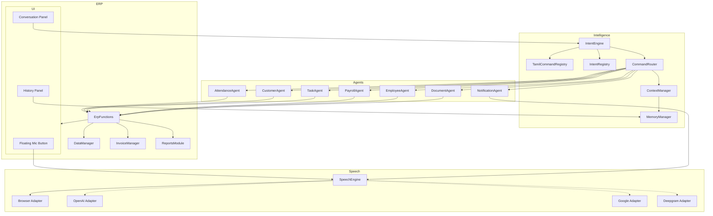

# MJS Prime Logic — Voice ERP Agent V1

Production voice assistant for Tamil, English, and Tanglish commands. **Free mode** uses Browser Web Speech API + rule-based intent engine with direct ERP integration (no paid APIs required).

## Architecture



## Folder Structure

```
ai/
  voiceAgent.js              # Main orchestrator + UI
  speechEngine.js            # Provider abstraction
  speechAdapters/
    browserSpeechAdapter.js  # Default (Web Speech API)
    openaiSpeechAdapter.js   # Future
    googleSpeechAdapter.js   # Future
    deepgramSpeechAdapter.js # Future
  intentEngine.js            # Rule-based NLP
  intentRegistry.js          # Intent → agent map
  tamilCommandRegistry.js    # Tamil / Tanglish patterns
  commandRouter.js           # Intent → ERP execution
  contextManager.js          # Follow-up context
  memoryManager.js           # localStorage persistence
  conversationHistory.js     # History panel
  erpFunctions.js            # ERP function registry
  attendanceAgent.js
  customerAgent.js
  taskAgent.js
  payrollAgent.js
  employeeAgent.js
  documentAgent.js
  notificationAgent.js
css/
  voice-agent.css
docs/
  VOICE_ERP_AGENT.md
```

## Database Integration Plan

| Domain | Storage Key / Module | Voice Actions |
|--------|---------------------|---------------|
| Attendance | `DataManager.getAttendance()` / `saveAttendance()` | mark present, leave, half day, absent list |
| Employees | `DataManager.getActiveEmployees()` | OT, salary info, attendance summary |
| Customers | `CustomerManager` | outstanding, last invoice, search |
| Invoices | `InvoiceManager` | outstanding balance, create invoice |
| Tasks | `DataManager.KEYS.TASKS` | create, complete, pending list |
| Payroll | `ReportsModule.startSalaryPayoutFlow()` | generate salary, summary |
| Documents | `InvoicesUI`, `DeliveryUI` | invoice, DC, job card, quotation |
| Context | `localStorage` (`gtes_voice_agent_*`) | last customer, employee, confirmation |

## ERP Function Registry

| Function | Module | Description |
|----------|--------|-------------|
| `markAttendanceDirect` | `erpFunctions.js` | Write attendance record |
| `getAbsentEmployeesToday` | `erpFunctions.js` | List not-present today |
| `getCustomerOutstanding` | `erpFunctions.js` | Pending invoices sum |
| `getCustomerLastInvoice` | `erpFunctions.js` | Latest invoice for customer |
| `getEmployeeOtHours` | `erpFunctions.js` | Monthly OT from attendance |
| `createTaskDirect` | `erpFunctions.js` | Add task to TASKS store |
| `completeTaskByHint` | `erpFunctions.js` | Complete open task |
| `navigate` | `erpFunctions.js` | `App.showView()` routing |

## Intent Registry (summary)

| Intent | Agent | Example |
|--------|-------|---------|
| `mark_attendance` | attendance | Rajesh attendance podu |
| `mark_leave` | attendance | Kumar leave mark pannu |
| `absent_employees` | attendance | Yaar absent inniku |
| `customer_outstanding` | customer | Avon Oxygen pending evlo |
| `last_invoice` | customer | Last invoice kaatu (context) |
| `employee_ot` | employee | Kumar OT evlo |
| `generate_salary` | payroll | March salary generate pannu |
| `create_task` | task | Installation task create pannu |
| `complete_task` | task | Task complete pannu |
| `create_invoice` | document | Invoice create pannu |
| `create_delivery_challan` | document | Delivery challan create pannu |
| `create_job_card` | document | Job card create pannu |
| `delete_*` | various | Requires voice confirmation |

## Tamil Command Registry

Patterns live in `ai/tamilCommandRegistry.js`. Tanglish verbs:

| Verb | Meaning |
|------|---------|
| podu | create / set |
| pannu | do |
| kaatu | show |
| evlo | how much |
| inniku | today |

## UI Screens

1. **Floating mic** (`#globalAIBtn`) — push-to-talk (hold) or continuous (tap)
2. **Voice panel** — status, live transcript, manual text input
3. **History drawer** — last 20 user/assistant turns
4. **Listening overlay** — full-screen pulse while mic active

## Modes

### Phase 14 — Free Mode (default)

- Speech: `browser` adapter
- AI: `IntentEngine` + `TamilCommandRegistry`
- No API keys

### Phase 15 — Future Mode

Set `MemoryManager.saveSettings({ speechProvider: 'openai' | 'google' | 'deepgram' })`. Adapters fall back to browser until credentials are configured. **ERP agents unchanged.**

## Safety (Phase 12)

Destructive intents (`delete_invoice`, `delete_task`, `delete_attendance`) set `ContextManager.pendingConfirmation`. User must say **yes / confirm / pannu / seri** before execution.

## Development Roadmap

| Phase | Status | Notes |
|-------|--------|-------|
| 1 Speech | Done | Browser adapter + abstraction |
| 2 Intent | Done | Rule engine + Tamil registry |
| 3 Router | Done | CommandRouter → agents |
| 4 Attendance | Done | Mark, leave, absent, summary |
| 5 Tasks | Done | Create, complete, pending |
| 6 Customer | Done | Outstanding, last invoice |
| 7 Employee | Done | OT, salary, attendance |
| 8 Payroll | Done | Salary payout flow |
| 9 Documents | Done | Invoice, DC, job card openers |
| 10 Responses | Done | NotificationAgent + TTS |
| 11 Context | Done | ContextManager + MemoryManager |
| 12 Safety | Done | Confirmation gate |
| 13 UI | Done | Mic, panel, history, PTT |
| 14 Free mode | Done | No paid APIs |
| 15 Future adapters | Stub | OpenAI / Google / Deepgram |

### Next enhancements

- Gemini/LLM optional mode (reuse legacy `ai_assistant.js` as provider)
- WhatsApp Evolution API notifications via `notificationAgent`
- Service report + quotation direct create
- Employee delete confirmation with name slot extraction

## Loading Order (index.html)

Load after `app.js` dependencies (`DataManager`, `InvoiceManager`, `ReportsModule`, etc.):

1. Registry & memory modules
2. `erpFunctions.js`
3. Agents
4. `speechAdapters/*` → `speechEngine.js`
5. `intentEngine.js` → `commandRouter.js`
6. `voiceAgent.js`
